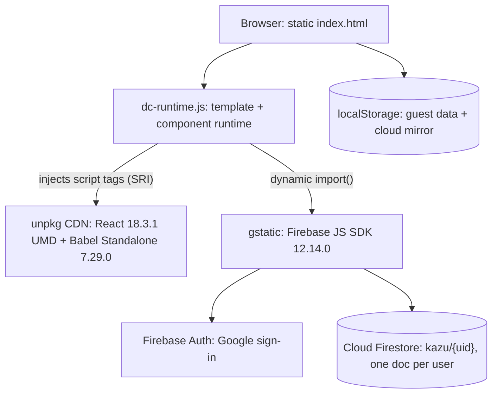

# Kazu

A flashcard app for learning how Japanese numbers are actually read out loud: the numbers themselves, the counter words that change their readings, and the date and time forms. Same Duolingo-style loop as its sibling apps, flashcard practice plus a multiple choice quiz with hearts, combos, and a streak, with missed items pulled into a focused review set. Works as a guest on the device, or syncs across devices with Google sign-in.

**Live demo: https://kazu.clayborne.dev** (no account needed to try it).

Kazu is one of three apps on a shared engine. The siblings are [Kanade](https://kanade.clayborne.dev) for the Japanese kana and [Baybayin](https://baybayin.clayborne.dev) for the pre-colonial Philippine script. Kanade came first and Kazu is derived from it, but Kazu is the one that stretched the engine the most, because number readings behave differently from single glyphs. This README covers Kazu specifically, including where it diverges from the shared engine, and then the engine itself.

<!-- SCREENSHOT / DEMO GIF GOES HERE -->
> **Demo placeholder:** add a screenshot of the quiz and a GIF of the number chart with a row being tapped to hear it.

## What it teaches

270 cards across 24 parts, grouped into three categories:

- **Numbers.** Basics 0 to 10, the tens, the hundreds, the thousands, and man and oku (ten-thousands and hundred-millions). This covers the sound shifts that trip people up, like 300 (sanbyaku), 600 (roppyaku), and 8000 (hassen).
- **Counters, 13 of them.** tsu (general things), ko (objects), nin/jin (people), hon (long thin things), mai (flat things), hiki (small animals), dai (machines), satsu (books), sai (age), hai (cupfuls), kai (floors), kai (times), en (yen). Each carries its own set of sound changes.
- **Date and time.** getsu/gatsu (months), nichi/ka (days of the month, with the irregular readings tsuitachi, futsuka, hatsuka and so on), youbi (weekdays), ji (hours), fun/pun (minutes), jikan (durations).

Each card has the number as shown, its kanji, the kana reading (the answer side), romaji, a Korean gloss, and a note. The notes explain the irregular readings, and every distinct note has a full English translation for English mode, not just a few of them.

## How Kazu differs from its siblings

Numbers are not like kana. A kana glyph maps to exactly one reading, but a number reading shows up under many parts, so the shared engine needed two real changes here.

- **Stats are keyed by `part:num`, not by the reading.** The identifier for each card's history is the part plus the number, for example `hyaku:300` or `kai_floor:1kai`. Keying by the reading would be wrong, because ikkai is both '1st floor' and 'one time', and those are two different things to learn. Kanade can key by the glyph because glyphs are unique; Kazu cannot.
- **The quiz guards against homophones.** When it builds the six choices, it skips any distractor whose kana reading matches the correct answer's reading, so you never see '1st floor' and 'one time' as two options that both read ikkai. Kanade has no need for this.
- **The chart is a list, not a grid.** Readings like juuyokka are too long for a tidy grid cell, so each part is a scrollable list of rows (number, reading, note, and a speaker button). Long readings and long answer options also shrink their font to fit.
- **Speech plays on its own.** The reading is spoken when you reveal a practice answer, when you answer a quiz question, and when you tap a chart row. Kanade only speaks on a chart tap.
- **The wrong-answer red is a separate color.** Because the brand color here is teal, the theme keeps a distinct `--err` red so wrong answers and error stats still read as red. Kanade did not need this since its brand is already red.

Question direction is number to reading, reading to number, or a random mix.

## Architecture

There is no server of my own. The app is static files, and Firebase is the only backend.



Nothing is bundled in the deploy path. `dc-runtime.js` is prebuilt and checked in, React and Babel Standalone load from unpkg at runtime, and the Firebase SDK loads from gstatic through a dynamic `import()`. Deploying an update is a `git pull` with no build and no restart.

`dc-runtime.js` is a small runtime compiled from TypeScript. It parses the `<x-dc>` template and a `DCLogic` component class out of `index.html` and renders them with React. The template has its own directives (`sc-if`, `sc-for`, `{{ }}` interpolation, and a `style-active` pressed state), and the component is a plain React-style lifecycle with a `renderVals()` method that builds the view model. The card data, the strings, and the readings live in `kazu-duo-data.js`, exposed as `window.__KAZU_DATA`. The runtime file itself is byte for byte identical to the one in Kanade and Baybayin.

## Accounts and sync

The design goal was that a returning signed-in user never sees a loading screen, and that guest and cloud data cross over cleanly.

- **Guest mode** keeps the profile in `localStorage` and writes on every change. It is fully functional on its own.
- **Cloud mode** stores the profile as a single Firestore document at `kazu/{uid}`. Sign-in is Google through Firebase Auth, `signInWithPopup` with a `signInWithRedirect` fallback when popups are blocked.
- **Boot is mirror first.** A returning cloud user reaches home immediately from a `localStorage` mirror, before Firestore answers, then the app reconciles in the background: the Firestore local cache first, then the server copy under a timeout.
- **First sign-in promotes the device's guest records** into the new cloud document, and the nickname becomes the Google display name. Signing out returns you to the untouched guest profile.
- **Account-switch guard.** If the on-device mirror belongs to a different user id than the account that just signed in, the mirror is discarded, so one account's progress cannot leak into another's document.
- **Writes are debounced 2 seconds** and merged (`setDoc` with `merge: true`), then flushed on tab hide, page unload, and session end. Offline writes queue in the SDK's persistent local cache. Firestore uses forced long polling and a single-tab persistent cache to keep working where streaming is blocked.

Kazu and Kanade share the Firebase project but keep separate collections (`kazu/{uid}` and `users/{uid}`), so the two apps' records never mix.

## Game mechanics

- **Practice** flips a card, you mark whether you knew it, and missed cards are saved for a one-tap retry.
- **Quiz** gives six choices (keys 1 through 6 work). Five hearts per session; a wrong answer costs one and running out ends the session. A combo counter tracks correct runs and saves your best. Hard mode adds a per-question timer of 3, 5, or 7 seconds.
- **Review** gathers any item seen at least 3 times with an error rate of 30% or higher, worst first.
- **My Page** has a 17-week activity heatmap in the GitHub style, totals, accuracy, days studied, the streak, and a per-item error grid colored from green to red.
- **Sound effects** are synthesized with the Web Audio API, so there are no audio files. They can be turned off.
- **Keyboard:** Space or Enter reveals and advances in practice, X marks "didn't know," 1 through 6 answer the quiz.

## Tech stack

**Frontend:** static HTML, CSS, and JavaScript. UI authored as an `<x-dc>` template plus a `DCLogic` class, rendered by `dc-runtime.js`. React 18.3.1 (UMD) and Babel Standalone 7.29.0 from unpkg, with Babel compiling the component script in the browser. Light and dark themes in CSS custom properties, auto-detected and toggleable. Brand color teal `#12A79E`, with a separate `--err` red for wrong answers. Fonts Jua and M PLUS Rounded 1c from Google Fonts.

**Auth and data:** Firebase JS SDK 12.14.0 from gstatic. Google sign-in and Cloud Firestore, project `japanese-site-a0af9`, collection `kazu`, document `kazu/{uid}`. The Firebase web config in the client is public by design; access is governed by Firestore security rules.

**Speech:** the Web Speech API (`SpeechSynthesis`), voice `ja-JP`, speaking the kana reading.

**Language:** Korean and English UI, Korean by default with browser-language detection on first visit.

### localStorage keys

| Key | Purpose |
|---|---|
| `kazu-duo-guest` | Guest study profile (nick, per-item stats, activity, best combo) |
| `kazu-duo-cloud` | Local mirror of the signed-in profile for instant boot |
| `kazu-duo-mode` | `guest` or `cloud`, decides the entry path next visit |
| `kazu-duo-setup` | Study settings (parts, question direction, hard mode, time limit) |
| `kazu-duo-lang` / `kazu-duo-theme` / `kazu-duo-sound` | UI preferences |

On first run the app imports any legacy `kazu-local` records read only, so earlier history carries over without being written back.

## Running locally

Static files, so any static server works:

```bash
cd kazu
python3 -m http.server 8000
# open http://localhost:8000
```

It needs internet for the CDNs (React and Babel from unpkg, Firebase from gstatic, fonts from Google). Google sign-in only works from an authorized domain, so locally you use guest mode, which exercises everything except cloud sync. In production the app is served by Caddy as static files on a shared EC2 instance, alongside an earlier single-file version of the app kept in the repo.

## Known limitations

- **No automated tests.**
- **React and Babel load from unpkg and compile in the browser.** Convenient (no build) but it ships a compiler to the client and makes cold start depend on unpkg. A build step would remove both.
- **The whole profile is one Firestore document,** read and written as a single blob. Fine at this size.
- **Text to speech depends on the device having a Japanese voice.**
- **Review is a threshold rule** (seen count and error rate), not a spaced-repetition schedule.

## The family

Kazu, Kanade, and Baybayin are the same engine with different data and theming. The runtime file is identical across all three; each app ships its own data module, colors, Firestore collection, and storage prefix.

| App | Teaches | Cards | Brand color | Firestore | TTS |
|---|---|---|---|---|---|
| [Kanade](https://kanade.clayborne.dev) | Hiragana and katakana | 208 | Red `#E0483E` | `users/{uid}` | `ja-JP` |
| **Kazu** | Japanese numbers, counters, dates | 270 | Teal `#12A79E` | `kazu/{uid}` | `ja-JP` |
| [Baybayin](https://baybayin.clayborne.dev) | Baybayin script | 59 | Indigo `#5B54E8` | `baybay_users/{uid}` | `fil-PH` |

Repositories: [kanade](https://github.com/ClayborneYeounjunLee/kanade) | [kazu](https://github.com/ClayborneYeounjunLee/kazu) | [baybayin](https://github.com/ClayborneYeounjunLee/baybayin)
